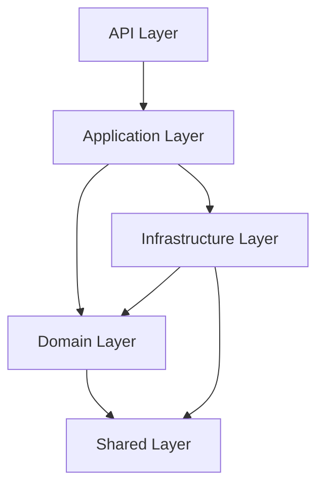

# Kanban Board Application

This is a Kanban Board application built with .NET 9 following Clean Architecture principles and Domain-Driven Design (DDD) patterns.

## Architecture Overview

The solution follows a layered architecture with clear separation of concerns:

### Layered Architecture

1. **API Layer (Presentation)**
   - Contains controllers, middleware, and API configurations
   - Handles HTTP requests and responses
   - References Application and Infrastructure layers

2. **Application Layer**
   - Contains application services and business logic orchestration
   - Implements use cases and coordinates between domain and infrastructure
   - Defines service interfaces that are implemented in the Infrastructure layer
   - References Domain and Shared layers

3. **Domain Layer (Core)**
   - Contains core business logic, entities, value objects, and domain events
   - Defines repository interfaces that are implemented in the Infrastructure layer
   - References only the Shared layer

4. **Infrastructure Layer**
   - Implements data access using Entity Framework Core
   - Contains repository implementations, DbContext, and external service integrations
   - References Domain and Application layers

5. **Shared Layer**
   - Contains shared utilities like DTOs, base exceptions, and common models
   - Referenced by all other layers

### Key Features

- **Clean Architecture**: Maintains separation of concerns with dependency inversion
- **Domain-Driven Design**: Entities, value objects, domain events, and repositories
- **JWT Authentication**: Secure authentication with refresh token support
- **Entity Framework Core**: Data persistence with PostgreSQL
- **AutoMapper**: Object-to-object mapping
- **Swagger**: API documentation
- **ASP.NET Core Identity**: User management and role-based authorization

### Technologies Used

- .NET 9
- ASP.NET Core Web API
- Entity Framework Core
- PostgreSQL (via Npgsql)
- JWT for authentication
- AutoMapper
- Swagger/OpenAPI